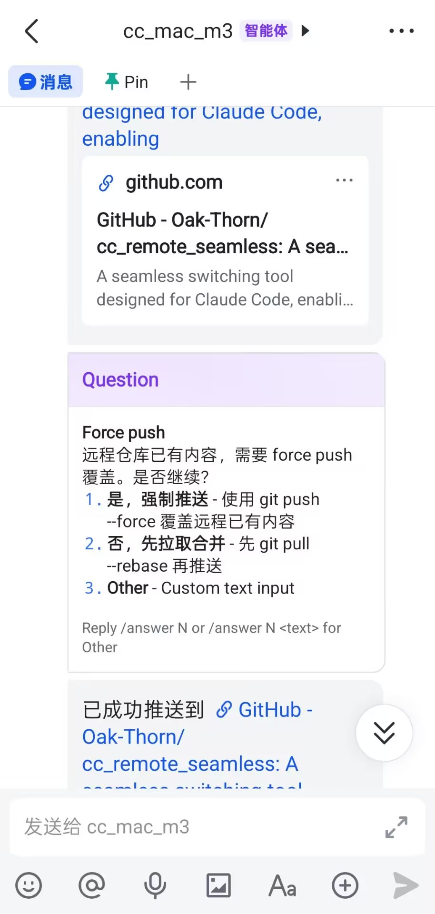
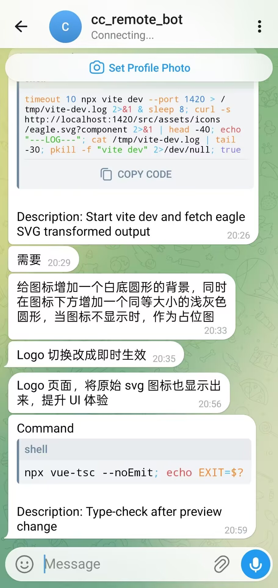

<p align="center">
  
</p>
<h1 align="center">CC Remote Seamless</h1>
<p align="center">
  <a href="#english">English</a> · <a href="#中文">中文</a>
</p>
<p align="center">
  <a href="https://github.com/Oak-Thorn/cc_remote_seamless/releases"></a>
  
  <a href="LICENSE"></a>
</p>

<p align="center">
  
  &nbsp;&nbsp;
  
</p>

---

<a id="english"></a>

## English

Remote control your running Claude Code / Pi Agent CLI sessions via Feishu or Telegram. Walk away from your computer and keep interacting with your Agent from your phone.

### Features

- **Seamless terminal experience** — desktop CLI keeps full ANSI formatting, colors, and interactivity; remote control has zero impact
- **Multi-platform IM** — supports Feishu (WebSocket) and Telegram (Bot API) simultaneously
- **Multi-Agent** — Claude Code and Pi Agent, switch with `/change`
- **Slash commands** — `/status`, `/list`, `/switch`, `/mute`, `/p`, `/allow`, `/answer`, etc.
- **Remote permission approval** — tool permission requests pushed to IM, respond with `/allow`, `/deny`, `/always`
- **Remote Q&A** — AskUserQuestion pushed as cards, reply with `/answer N`
- **Desktop floating widget** — always-on-top icon with status color, expandable session list
- **Sound alerts** — configurable sounds on idle and permission events
- **Auto hook installation** — Claude Code hooks configured automatically on startup
- **No public IP needed** — Feishu WebSocket + Telegram long polling, client-initiated connections

### Quick Start

#### Prerequisites

- **Rust** toolchain (stable)
- **Node.js** 20+
- **Go** 1.22+

#### Build from Source

```bash
# 1. Clone the repository
git clone https://github.com/Oak-Thorn/cc_remote_seamless.git
cd cc_remote_seamless

# 2. Install frontend dependencies
npm ci

# 3. Build the sidecar (Feishu gateway)
cd sidecar/feishu-gateway
go build -o feishu-gateway-aarch64-apple-darwin .   # macOS Apple Silicon
# go build -o feishu-gateway-x86_64-apple-darwin .  # macOS Intel
# GOOS=windows GOARCH=amd64 go build -o feishu-gateway-x86_64-pc-windows-msvc.exe .  # Windows
cd ../..

# 4. Build the Tauri app
npm run tauri build
```

#### Build Outputs

| Platform | Path |
|----------|------|
| macOS .app | `target/release/bundle/macos/CC Remote Seamless.app` |
| macOS .dmg | `target/release/bundle/dmg/CC Remote Seamless_<ver>_aarch64.dmg` |
| Windows .msi | `target/release/bundle/msi/*.msi` |
| Windows .exe | `target/release/bundle/nsis/*.exe` |

#### Development Mode

```bash
npm run tauri dev
```

### Configuration

Create `~/.cc-remote/config.toml`:

```toml
[general]
hook_port = 23399

[platforms.feishu-main]
type = "feishu"
app_id = "cli_xxxxxxxxx"
app_secret = "xxxxxxxxxxxxxxxxxxxxxxxx"
chat_id = "oc_xxxxxxxxxxxxxxxxxxxxxxxx"

[agents.claude-code]
platforms = ["feishu-main"]
```

### Slash Commands

| Command | Description |
|---------|-------------|
| `/status` | View current session status |
| `/list` | List all active sessions |
| `/switch <id>` | Switch to specified session |
| `/change [agent]` | Switch agent type |
| `/p <text>` | Send prompt |
| `/mute` / `/unmute` | Mute/unmute message push |
| `/allow` / `/deny` / `/always` | Permission approval |
| `/answer <n>` | Answer a question |
| `/radar` | Re-discover running agents |
| `/stop` | Stop session |
| `/help` | Show help |

### Architecture

```
┌─────────────────────────────────────────────────────┐
│  CC Remote Seamless (Tauri 2 + Vue 3 + Rust)        │
│                                                     │
│  ┌─────────┐  ┌────────┐  ┌───────────────────┐    │
│  │ Float UI│  │ Engine │  │ Hook Server :23399│    │
│  │ (Widget)│←→│(Router)│←─│                   │←── Claude Code / Pi hooks
│  └─────────┘  └────────┘  └───────────────────┘    │
│                     ↕                               │
│  ┌─────────────────────────────────────────────┐    │
│  │ Agents: ClaudeCode | Pi                     │    │
│  └─────────────────────────────────────────────┘    │
│                     ↕                               │
│  ┌─────────────────────────────────────────────┐    │
│  │ Platforms: Feishu (Go sidecar, WebSocket)   │    │
│  │            Telegram (reqwest, long poll)     │    │
│  └─────────────────────────────────────────────┘    │
└─────────────────────────────────────────────────────┘
```

### CI/CD

GitHub Actions automatically builds for macOS (aarch64 + x86_64) and Windows (x86_64) on tag push or manual trigger. See `.github/workflows/build.yml`.

---

<a id="中文"></a>

## 中文

通过飞书或 Telegram 远程控制正在运行的 Claude Code / Pi Agent CLI 会话。离开电脑时，用手机继续与 Agent 交互。

### 功能特性

- **无损终端体验** — 桌面 CLI 保持完整 ANSI 格式、颜色、交互，远程控制零影响
- **多平台 IM** — 同时支持飞书（WebSocket）和 Telegram（Bot API），可配置多个平台
- **多 Agent 支持** — Claude Code 和 Pi Agent，通过 `/change` 切换
- **Slash 命令** — `/status`、`/list`、`/switch`、`/mute`、`/p`、`/allow`、`/answer` 等
- **权限远程审批** — 工具权限请求推送到 IM，支持 `/allow`、`/deny`、`/always`
- **Question 远程回答** — AskUserQuestion 推送卡片，通过 `/answer N` 回复
- **桌面浮窗** — 浮窗图标置顶，颜色随状态变化，展开显示 session 列表
- **音效提醒** — Agent 空闲和权限请求时播放可配置音效
- **自动 Hook 安装** — 启动时自动配置 Claude Code hooks
- **无需公网 IP** — 飞书 WebSocket + Telegram long polling，客户端主动发起连接

### 快速开始

#### 前置要求

- **Rust** 工具链（stable）
- **Node.js** 20+
- **Go** 1.22+

#### 从源码构建

```bash
# 1. 克隆仓库
git clone https://github.com/Oak-Thorn/cc_remote_seamless.git
cd cc_remote_seamless

# 2. 安装前端依赖
npm ci

# 3. 编译 sidecar（飞书网关）
cd sidecar/feishu-gateway
go build -o feishu-gateway-aarch64-apple-darwin .   # macOS Apple Silicon
# go build -o feishu-gateway-x86_64-apple-darwin .  # macOS Intel
# GOOS=windows GOARCH=amd64 go build -o feishu-gateway-x86_64-pc-windows-msvc.exe .  # Windows
cd ../..

# 4. 打包 Tauri 应用
npm run tauri build
```

#### 构建产物

| 平台 | 路径 |
|------|------|
| macOS .app | `target/release/bundle/macos/CC Remote Seamless.app` |
| macOS .dmg | `target/release/bundle/dmg/CC Remote Seamless_<ver>_aarch64.dmg` |
| Windows .msi | `target/release/bundle/msi/*.msi` |
| Windows .exe | `target/release/bundle/nsis/*.exe` |

#### 开发模式

```bash
npm run tauri dev
```

### 配置

创建 `~/.cc-remote/config.toml`：

```toml
[general]
hook_port = 23399

[platforms.feishu-main]
type = "feishu"
app_id = "cli_xxxxxxxxx"
app_secret = "xxxxxxxxxxxxxxxxxxxxxxxx"
chat_id = "oc_xxxxxxxxxxxxxxxxxxxxxxxx"

[agents.claude-code]
platforms = ["feishu-main"]
```

### Slash 命令

| 命令 | 说明 |
|------|------|
| `/status` | 查看当前会话状态 |
| `/list` | 列出所有活跃会话 |
| `/switch <id>` | 切换到指定 session |
| `/change [agent]` | 切换 Agent 类型 |
| `/p <text>` | 发送 prompt |
| `/mute` / `/unmute` | 静音/恢复消息推送 |
| `/allow` / `/deny` / `/always` | 权限审批 |
| `/answer <n>` | 回答问题 |
| `/radar` | 重新发现已启动的 agent |
| `/stop` | 停止 session |
| `/help` | 显示帮助 |

### 架构概览

```
┌─────────────────────────────────────────────────────┐
│  CC Remote Seamless (Tauri 2 + Vue 3 + Rust)        │
│                                                     │
│  ┌─────────┐  ┌────────┐  ┌───────────────────┐    │
│  │ 浮窗 UI │  │ Engine │  │ Hook Server :23399│    │
│  │(状态图标)│←→│(Router)│←─│                   │←── Claude Code / Pi hooks
│  └─────────┘  └────────┘  └───────────────────┘    │
│                     ↕                               │
│  ┌─────────────────────────────────────────────┐    │
│  │ Agents: ClaudeCode | Pi                     │    │
│  └─────────────────────────────────────────────┘    │
│                     ↕                               │
│  ┌─────────────────────────────────────────────┐    │
│  │ Platforms: 飞书 (Go sidecar, WebSocket)     │    │
│  │            Telegram (reqwest, long poll)     │    │
│  └─────────────────────────────────────────────┘    │
└─────────────────────────────────────────────────────┘
```

### CI/CD

GitHub Actions 在推送 tag 或手动触发时，自动为 macOS（aarch64 + x86_64）和 Windows（x86_64）构建安装包。配置见 `.github/workflows/build.yml`。

---

## License

[MIT](LICENSE)
