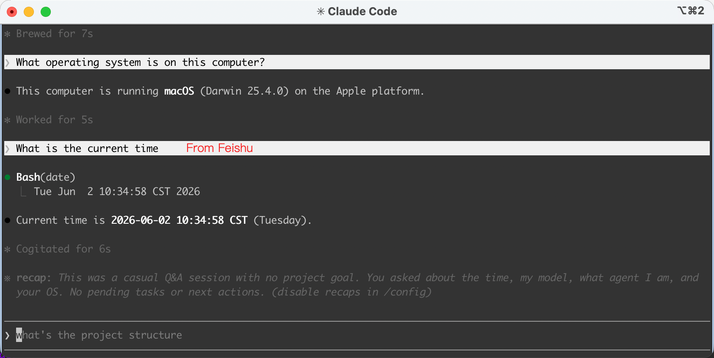
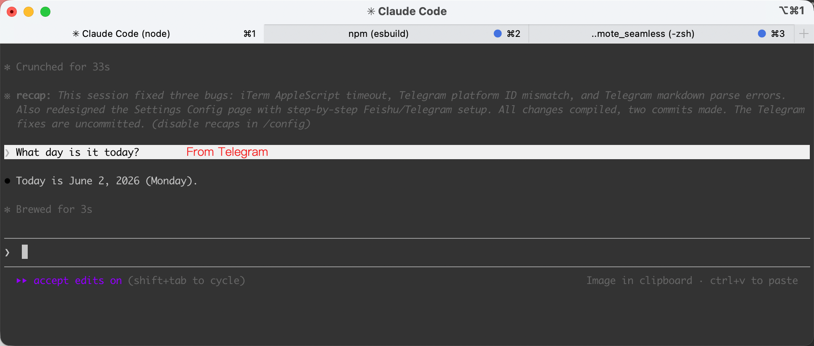
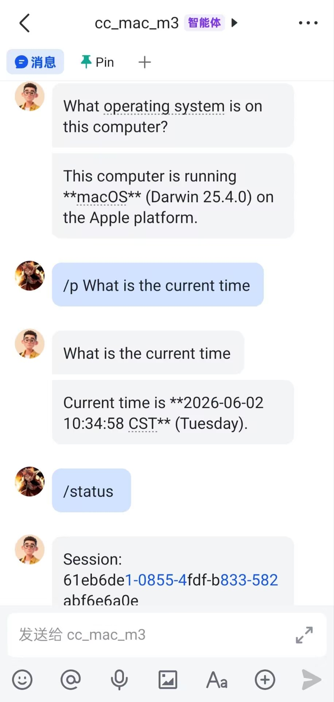
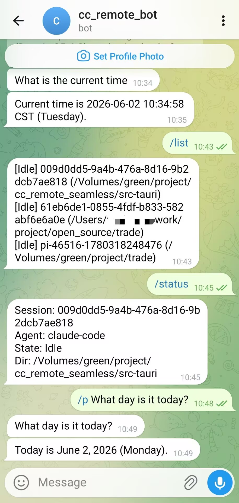

<p align="center">
  
</p>
<h1 align="center">CC Remote Seamless</h1>
<p align="center">
  <a href="README.md">English</a>
</p>
<p align="center">
  <a href="https://github.com/Oak-Thorn/cc_remote_seamless/releases"></a>
  
  <a href="LICENSE"></a>
</p>

<p align="center">
  
  &nbsp;&nbsp;
  
</p>
<p align="center">
  
  &nbsp;&nbsp;
  
</p>

通过飞书或 Telegram 远程控制正在运行的 Claude Code / Pi Agent CLI 会话。离开电脑时，用手机继续与 Agent 交互。

## 功能特性

- **无损终端体验** — 桌面 CLI 保持完整 ANSI 格式、颜色、交互，远程控制零影响
- **多平台 IM** — 同时支持飞书（WebSocket）和 Telegram（Bot API），可配置多个平台
- **多 Agent 支持** — Claude Code 和 Pi Agent，通过 `/change` 切换
- **Slash 命令** — `/status`、`/list`、`/switch`、`/mute`、`/p`、`/allow`、`/answer` 等
- **权限远程审批** — 工具权限请求推送到 IM，支持 `/allow`、`/deny`、`/always`
- **Question 远程回答** — AskUserQuestion 推送卡片，通过 `/answer N` 回复
- **桌面浮窗** — 浮窗图标置顶，颜色随状态变化，展开显示 session 列表
- **音效提醒** — Agent 空闲和权限请求时播放可配置音效
- **自动 Hook 安装** — 启动时自动配置 Claude Code hooks
- **无需公网 IP** — 飞书 WebSocket + Telegram long polling，客户端主动发起连接

## 安装

从 [GitHub Releases](https://github.com/Oak-Thorn/cc_remote_seamless/releases) 下载最新版本。

### macOS

挂载 DMG 并将应用拖入 Applications 后，macOS Gatekeeper 可能会提示应用"已损坏"，这是因为应用未经 Apple 签名。执行以下命令解除限制：

```bash
xattr -cr /Applications/CC\ Remote\ Seamless.app
```

然后正常打开应用即可。

### Windows

直接运行 `.exe` 安装包，无需额外操作。

## 快速开始

### 前置要求

- **Rust** 工具链（stable）
- **Node.js** 20+
- **Go** 1.22+

### 从源码构建

```bash
# 1. 克隆仓库
git clone https://github.com/Oak-Thorn/cc_remote_seamless.git
cd cc_remote_seamless

# 2. 安装前端依赖
npm ci

# 3. 编译 sidecar（飞书网关）
cd sidecar/feishu-gateway
go build -o feishu-gateway-aarch64-apple-darwin .   # macOS Apple Silicon
# go build -o feishu-gateway-x86_64-apple-darwin .  # macOS Intel
# GOOS=windows GOARCH=amd64 go build -o feishu-gateway-x86_64-pc-windows-msvc.exe .  # Windows
cd ../..

# 4. 打包 Tauri 应用
npm run tauri build
```

### 构建产物

| 平台 | 路径 |
|------|------|
| macOS .app | `target/release/bundle/macos/CC Remote Seamless.app` |
| macOS .dmg | `target/release/bundle/dmg/CC Remote Seamless_<ver>_aarch64.dmg` |
| Windows .msi | `target/release/bundle/msi/*.msi` |
| Windows .exe | `target/release/bundle/nsis/*.exe` |

### 开发模式

```bash
npm run tauri dev
```

## 配置

创建 `~/.cc-remote/config.toml`：

```toml
[general]
hook_port = 23399

[platforms.feishu-main]
type = "feishu"
app_id = "cli_xxxxxxxxx"
app_secret = "xxxxxxxxxxxxxxxxxxxxxxxx"
chat_id = "oc_xxxxxxxxxxxxxxxxxxxxxxxx"

[agents.claude-code]
platforms = ["feishu-main"]
```

## Slash 命令

| 命令 | 说明 |
|------|------|
| `/status` | 查看当前会话状态 |
| `/list` | 列出所有活跃会话 |
| `/switch <id>` | 切换到指定 session |
| `/change [agent]` | 切换 Agent 类型 |
| `/p <text>` | 发送 prompt |
| `/mute` / `/unmute` | 静音/恢复消息推送 |
| `/allow` / `/deny` / `/always` | 权限审批 |
| `/answer <n>` | 回答问题 |
| `/radar` | 重新发现已启动的 agent |
| `/stop` | 停止 session |
| `/help` | 显示帮助 |

## 架构概览

```
┌─────────────────────────────────────────────────────┐
│  CC Remote Seamless (Tauri 2 + Vue 3 + Rust)        │
│                                                     │
│  ┌─────────┐  ┌────────┐  ┌───────────────────┐    │
│  │ 浮窗 UI │  │ Engine │  │ Hook Server :23399│    │
│  │(状态图标)│←→│(Router)│←─│                   │←── Claude Code / Pi hooks
│  └─────────┘  └────────┘  └───────────────────┘    │
│                     ↕                               │
│  ┌─────────────────────────────────────────────┐    │
│  │ Agents: ClaudeCode | Pi                     │    │
│  └─────────────────────────────────────────────┘    │
│                     ↕                               │
│  ┌─────────────────────────────────────────────┐    │
│  │ Platforms: 飞书 (Go sidecar, WebSocket)     │    │
│  │            Telegram (reqwest, long poll)     │    │
│  └─────────────────────────────────────────────┘    │
└─────────────────────────────────────────────────────┘
```

## CI/CD

GitHub Actions 在推送 tag 或手动触发时，自动为 macOS（aarch64 + x86_64）和 Windows（x86_64）构建安装包。配置见 `.github/workflows/build.yml`。

## 许可证

[MIT](LICENSE)
